# 📊 Marketing & Product Analytics in SQL

[](https://github.com/zakhjs-labs/)

## 🚀 Краткое описание

В этом проекте представлен анализ маркетинговых и продуктовых метрик, а также поведения пользователей и курьеров сервиса доставки.

В репозитории вы найдете:

-   🧠 Структурированные SQL-запросы по тематикам
-   📊 Визуализации и графики
-   📝 Интерпретации и выводы по метрикам
-   📺 Интерактивные дашбоарды, созданные в Redash и Tableau.

    **Данные**: open source database for product delivery service.
    **Инструменты**: SQL, PostgreSQL, Redash, Tableau.

---

## 📚 Содержание

-   [🗃️ Структура базы данных](#️-структура-базы-данных)
-   [📈 Маркетинговые метрики](#-маркетинговые-метрики)
    -   [📌 CAC (Customer Acquisition Cost)](#-cac-customer-acquisition-cost)
    -   [📌 ROI (Return on Investment)](#-roi-return-on-investment)
    -   [📌 Средний чек](#-средний-чек)
    -   [📌 Retention rate](#-retention-rate)
    -   [📌 Retention для групп пользователей](#-retention-для-групп-пользователей)
    -   [📌 Накопительный ARPPU и CAC](#-накопительный-arppu-и-cac-определение-времени-превышения-доходов-от-заказов-пользователей-относительно-расходов-на-их-привлечение)
    -   [📽️ Дашбоард маркетинговых метрик](#️-дашбоард-маркетинговых-метрик)
-   [📦 Продуктовые метрики](#-продуктовые-метрики)
    -   [📌 Динамика ежедневной и общей выручки (revenue)](#-динамика-ежедневной-и-общей-выручки-revenue)
    -   [📌 Расчет ARPU, ARPPU, AOV](#-расчет-arpu-arppu-aov)
    -   [📌 Расчёт динамически ARPU, ARPPU и AOV](#-расчёт-динамически-arpu-arppu-и-aov)
    -   [📌 ARPU, ARPPU, AOV по дням недели](#-arpu-arppu-aov-по-дням-недели)
    -   [📌 Расчет доли выручки с заказов новых и старых пользователей](#-расчет-доли-выручки-с-заказов-новых-и-старых-пользователей)
    -   [📌 Доля выручки товаров (от общей выручки)](#-доля-выручки-товаров-от-общей-выручки)
    -   [📌 Динамика суммарной валовой прибыли](#-динамика-суммарной-валовой-прибыли)
    -   [📽️ Дашбоард продуктовых метрик](#️-дашбоард-продуктовых-метрик)
-   [🛠️ Анализ заказов и действий пользователей и курьеров](#️-анализ-заказов-и-действий-пользователей-и-курьеров)

    -   [📌 Динамика числа пользователей и курьеров](#-динамика-числа-пользователей-и-курьеров)
    -   [📌 Динамика прироста числа новых пользователей и курьеров](#-динамика-прироста-числа-новых-пользователей-и-курьеров)
    -   [📌 Динамика платящих пользователей и активных курьеров](#-динамика-платящих-пользователей-и-активных-курьеров)
    -   [📌 Доли пользователей с одним и несколькими заказами](#-доли-пользователей-с-одним-и-несколькими-заказами)
    -   [📌 Динамика общего числа заказов, первых заказов и заказов новых пользователей](#-динамика-общего-числа-заказов-числа-первых-заказов-и-числа-заказов-новых-пользователей)
    -   [📌 Динамика числа пользователей и заказов на одного курьера](#-динамика-числа-пользователей-и-заказов-на-одного-курьера)
    -   [📌 Динамика среднего времени доставки заказов](#-динамика-среднего-времени-доставки-заказов)
    -   [📌 Динамика доли отмененных заказов в общем числе заказов и числа успешных/отменённых заказов](#-динамика-доли-отмененных-заказов-в-общем-числе-заказов-и-числа-успешныхотменённых-заказов)
    -   [📽️ Дашбоард для анализа заказов, действий пользователей и курьеров](#️-дашбоард-для-анализа-заказов-действий-пользователей-и-курьеров)

-   [🧩 Витрина дашбоардов](#)
    -   [📽️ Дашбоард маркетинговых метрик](#️-дашбоард-маркетинговых-метрик)
    -   [📽️ Дашбоард продуктовых метрик](#️-дашбоард-продуктовых-метрик)
    -   [📽️ Дашбоард для анализа заказов, действий пользователей и курьеров](#️-дашбоард-для-анализа-заказов-действий-пользователей-и-курьеров)
-   [📬 Обратная связь](#обратная-связь)

---

## 🗃️ Структура базы данных

База данных сервиса доставки состоит из 6 взаимосвязанных таблиц, хранящих информацию о пользователях, курьерах, заказах и товарах. Ниже представлена схема данных и подробное описание каждой таблицы.


**Описание таблиц**

Пользователи (users)

| field      | type              | description                                 |
| ---------- | ----------------- | ------------------------------------------- |
| birth_date | date              | Дата рождения пользователя                  |
| user_id    | integer           | Уникальный ID пользователя (первичный ключ) |
| sex        | character varying | Пол пользователя (male/female)              |

Курьеры (couriers)

| field      | type              | description                            |
| ---------- | ----------------- | -------------------------------------- |
| birth_date | date              | Дата рождения курьера                  |
| courier_id | integer           | Уникальный ID курьера (первичный ключ) |
| sex        | character varying | Пол курьера (male/female)              |

Заказы (orders)

| field         | type       | description                           |
| ------------- | ---------- | ------------------------------------- |
| creation_time | timestamp  | Время создания заказа                 |
| order_id      | integer    | Уникальный ID заказа (первичный ключ) |
| product_ids   | array[int] | Массив ID товаров в заказе            |

Товары (products)

| field      | type              | description                           |
| ---------- | ----------------- | ------------------------------------- |
| name       | character varying | Название товара                       |
| price      | numeric           | Цена товара                           |
| product_id | integer           | Уникальный ID товара (первичный ключ) |

Действия пользователей (user_actions)

| field    | type              | description                           |
| -------- | ----------------- | ------------------------------------- |
| action   | character varying | Тип действия (например, create_order) |
| user_id  | integer           | ID пользователя (внешний ключ)        |
| order_id | integer           | ID заказа (внешний ключ)              |
| time     | timestamp         | Временная метка действия              |

Действия курьеров (courier_actions)

| field      | type              | description                            |
| ---------- | ----------------- | -------------------------------------- |
| action     | character varying | Тип действия (например, deliver_order) |
| courier_id | integer           | ID курьера (внешний ключ)              |
| order_id   | integer           | ID заказа (внешний ключ)               |
| time       | timestamp         | Временная метка действия               |

🔄 **Взаимосвязи**

-   Пользователи совершают действия с заказами через user_actions
-   Курьеры обрабатывают заказы через courier_actions
-   Заказы содержат ссылки на товары через массив product_ids
-   Все ключевые события фиксируются с временными метками

---

## 📈 Маркетинговые метрики

### 📌 CAC (Customer Acquisition Cost)

CAC — это метрика, отражающая среднюю стоимость привлечения одного нового пользователя или клиента. Она рассчитывается как отношение всех затрат на маркетинг и привлечение к количеству новых пользователей за выбранный период.

Формула:

<pre> CAC = Маркетинговые_затраты / Количество_новых_пользователей </pre>

Данная метрика позволяет оценить эффективность стратегий роста и масштабирования. Сравнение CAC с LTV (Lifetime Value) даёт представление о том, насколько выгодно привлекать новых клиентов, и помогает оптимизировать бюджет маркетинга.

[📄 Посмотреть SQL-запрос](marketing-metrics/1-cac/query.sql)

[📁Полный CSV](marketing-metrics/1-cac/query.csv)

| ads_campaign | cac     |
| ------------ | ------- |
| Кампания № 1 | 1461.99 |
| Кампания № 2 | 1068.38 |
| ...          | ...     |

---

CAC (Затраты на привлечение одного покупателя):
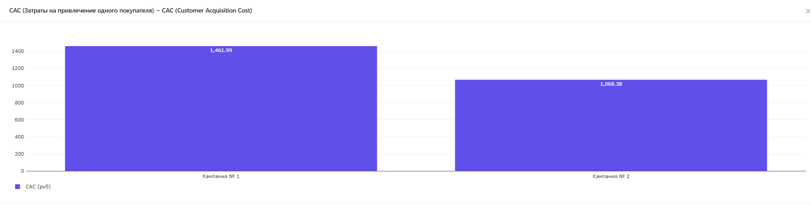

📌 **Интерпретация результата**

У компании 2 затраты на привлечение 1 покупателя ниже. Но мы не можем утверждать, что вторая рекламная кампания лучше только потому, что позволяет привлекать платящих пользователей за меньшие деньги. Делать такие выводы рано — оценим ещё один показатель, который отражает рентабельность инвестиций и показывает, насколько выгодным является тот или иной проект или продукт ROI (Return on Investment).

---

### 📌 ROI (Return on Investment)

ROI — это показатель окупаемости инвестиций, который отражает, насколько эффективно вложенные средства приносят доход. В контексте маркетинга ROI помогает понять, насколько результативны затраты на привлечение клиентов, рекламу или другие активности.

Чем выше ROI, тем эффективнее вложения.

📐 Формула

<pre>ROI = (Доход − Затраты) / Затраты * 100%</pre>

[📄 Посмотреть SQL-запрос](marketing-metrics/2-roi/query.sql)

[📁Полный CSV](marketing-metrics/2-roi/result.csv)

| ads_campaign | roi   |
| ------------ | ----- |
| Кампания № 1 | 14.5  |
| Кампания № 2 | -1.61 |
| ...          | ...   |

---

ROI (Return on Investment) окупаемость рекламных кампаний:
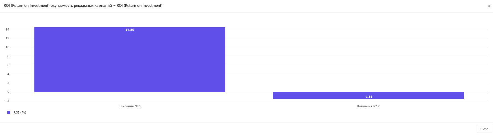

📌 **Интерпретация результата**

Несмотря на более высокий CAC первая кампания имеет положительный ROI, то есть позволяет окупать рекламные затраты. В то же время у второй рекламной кампании ROI отрицательный — пока что она работает в минус. Возможно со временем эти показатели изменятся, но на текущий момент первая рекламная кампания — более выгодное направление для инвестиций рекламного бюджета.

---

### 📌 Средний чек

Средний чек показывает, сколько в среднем тратит клиент за один заказ:

<pre>Средний чек = Общая сумма заказов / Количество заказов
</pre>

Для каждой рекламной кампании посчитаем среднюю стоимость заказа привлечённых пользователей за первую неделю использования приложения с 1 по 7 сентября.

[📄 Посмотреть SQL-запрос](marketing-metrics/3-avg-check/query.sql)

[📁Полный CSV](marketing-metrics/3-avg-check/result.csv)

| ads_campaign | avg_check |
| ------------ | --------- |
| Кампания № 2 | 380.88    |
| Кампания № 1 | 371.73    |
| ...          | ...       |

Средняя стоимость заказа (на пользователя):
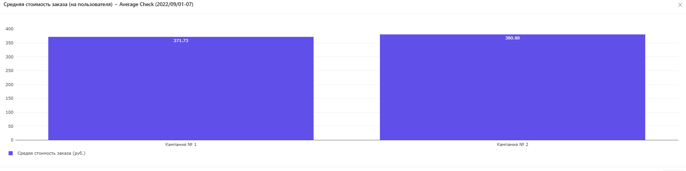

📌 **Интерпретация результата**

_Что можно сказать о среднем чеке пользователей в двух группа:_
Конечно, сказать однозначно, отличаются ли группы по среднему чеку, без статистических тестов нельзя, но всё же можно предположить, что различия несущественные. И что особенно интересно - средней чек даже немного выше во второй группе с отрицательным ROI.

---

### 📌 Retention rate

Retention rate — коэффициент удержания клиентов. Он показывает долю пользователей, которые вернулись в приложение спустя N дней, недель или месяцев после своего первого входа.

На основе данных в таблице user_actions рассчитаем показатель дневного Retention для всех пользователей, разбив их на когорты по дате первого взаимодействия с приложением.

[📄 Посмотреть SQL-запрос](marketing-metrics/4-retention/query.sql)

[📁Полный CSV](marketing-metrics/4-retention/result.csv)

| start_month | start_date | day_number | retention |
| ----------- | ---------- | ---------- | --------- |
| 01/08/22    | 24/08/22   | 0          | 1.0       |
| 01/08/22    | 24/08/22   | 1          | 0.14      |
| 01/08/22    | 24/08/22   | 2          | 0.15      |
| 01/08/22    | 24/08/22   | 3          | 0.18      |
| ...         | ...        |

Retention (по дате первого действия всех пользователей):
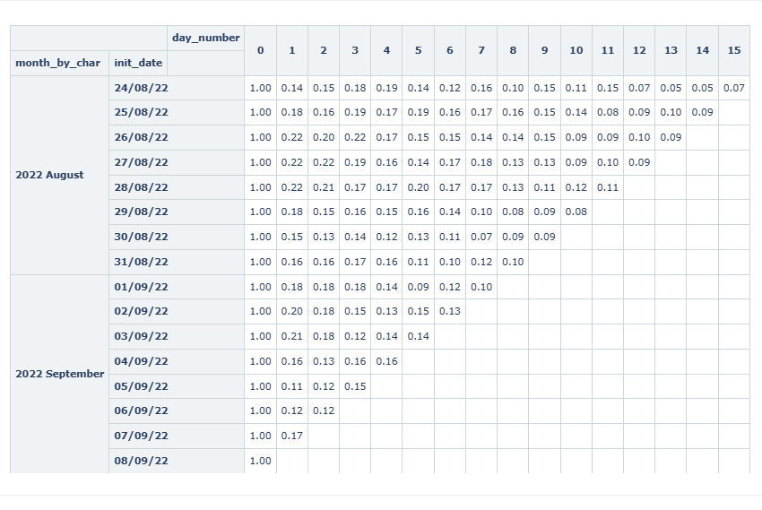

📌 **Интерпретация результата**

Представлены показатели retention с 0 по 15 день для пользователей, зарегистрированных в августе и сентябре 2022 года.

**Ключевые выводы:**

1. **Высокий отток в первые дни**:

    - На 1-й день retention падает до 14-22% (в августе) и 11-21% (в сентябре)
    - Это типичная картина для многих продуктов - наибольший отток происходит сразу после первого использования

2. **Стабилизация retention**:

    - После 7 дня retention стабилизируется на уровне 7-17%
    - К 15 дню значения составляют 5-11%

3. **Сравнение месяцев**:
    - В сентябре наблюдается немного более высокий retention на 1-й день по сравнению с августом (16-21% vs 14-22%)
    - Однако долгосрочный retention (7+ дней) в сентябре не показывает значительного улучшения
4. **Долгосрочное удержание**:
    - Через 15 дней сохраняется только 5-11% пользователей
    - Это указывает на необходимость улучшения долгосрочной вовлеченности

**Рекомендации:**

1. **Улучшение первого опыта**:

    - Проанализировать причины высокого оттока в первые дни
    - Оптимизировать onboarding-процесс

2. **Стимулирование возврата**:

    - Внедрить систему напоминаний/уведомлений для пользователей на 2-3 день
    - Предложить дополнительные ценности для вернувшихся пользователей

3. **Углубленный анализ**:

    - Исследовать причины различий между лучшими и худшими днями
    - Сравнить с другими периодами для выявления сезонных тенденций

4. **Сегментация аудитории**:
    - Проанализировать retention для разных групп пользователей
    - Выявить наиболее лояльные сегменты

Общий вывод: текущие показатели retention типичны для многих продуктов, но есть значительный потенциал для улучшения, особенно в первые дни использования.

---

### 📌 Retention для групп пользователей

Вернёмся к анализу рекламных кампаний и посчитаем Retention для двух групп пользователей. Возможно, дело именно в том, что один из каналов привёл более активных и заинтересованных пользователей.

Для каждой рекламной кампании расчитан Retention 1-го и 7-го дня у привлечённых пользователей.

[📄 Посмотреть SQL-запрос](marketing-metrics/5-retention-2-groups/query.sql)

[📁Полный CSV](marketing-metrics/5-retention-2-groups/result.csv)

| ads_campaign | start_date | retention | day_number |
| ------------ | ---------- | --------- | ---------- |
| Кампания № 1 | 01/09/22   | 1.0       | 0          |
| Кампания № 1 | 01/09/22   | 0.42      | 1          |
| Кампания № 1 | 01/09/22   | 0.22      | 7          |
| Кампания № 2 | 01/09/22   | 1.0       | 0          |
| Кампания № 2 | 01/09/22   | 0.17      | 1          |
| Кампания № 2 | 01/09/22   | 0.09      | 7          |
| ...          | ...        |

---

Retention (2 groups):

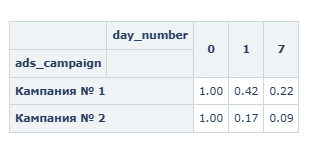

📌 **Интерпретация результата**

**Анализ рекламных кампаний с учетом Retention, ROI и CAC**

Сравнение ключевых метрик

| Параметр           | Кампания № 1  | Кампания № 2  |
| ------------------ | ------------- | ------------- |
| Retention (День 1) | 42%           | 17%           |
| Retention (День 7) | 22%           | 9%            |
| ROI                | Положительный | Отрицательный |
| CAC                | Выше          | Ниже          |

1. **Retention Rate**:

    - Кампания № 1 показывает **значительно лучшие** показатели удержания:
        - В 2.5 раза выше на 1-й день (42% vs 17%)
        - В 2.4 раза выше на 7-й день (22% vs 9%)
    - Это свидетельствует, что привлеченные через Кампанию № 1 пользователи более качественные и вовлеченные

2. **Экономические показатели**:
    - Несмотря на более высокий CAC, Кампания № 1 демонстрирует **положительный ROI**
    - Кампания № 2 при более низком CAC имеет **отрицательный ROI**, что делает ее экономически неэффективной

**Ключевые выводы**

1. **Качество vs Количество**:

    - Кампания № 1 привлекает меньше пользователей (из-за более высокого CAC), но они значительно более качественные
    - Кампания № 2 привлекает больше пользователей дешевле, но они плохо удерживаются и не окупаются

2. **Долгосрочная стратегия**:
    - Фокус на качество трафика, а не на его объем
    - Оптимизировать Кампанию № 2 для повышения retention или найти альтернативные каналы

Почему высокая retention важнее низкого CAC

В данном случае более высокий CAC Кампании № 1 компенсируется:

1. Лучшим удержанием пользователей (в 2.5 раза)
2. Положительной окупаемостью (ROI)
3. Вероятно, более высокой LTV (пожизненной ценностью) пользователей

---

### 📌 Накопительный ARPPU и CAC. Определение времени превышения доходов от заказов пользователей относительно расходов на их привлечение

Выясним, на какой день доход от заказов покупателей, пришедших после первой рекламной кампании, превысил расходы на их привлечение. Для этого рассчитаем накопительный ARPPU и сравним его с уже посчитанной ранее метрикой CAC. Сделаем это для двух кампаний, чтобы точно убедиться, что в случае второй рекламной кампании затраты пока не окупились.

[📄 Посмотреть SQL-запрос](marketing-metrics/6-cac-cumulative-arppu/query.sql)

[📁Полный CSV](marketing-metrics/6-cac-cumulative-arppu/result.csv)

| ads_campaign | day   | cumulative_arppu | cac     |
| ------------ | ----- | ---------------- | ------- |
| Кампания № 1 | Day 0 | 521.36           | 1461.99 |
| Кампания № 1 | Day 1 | 784.64           | 1461.99 |
| Кампания № 1 | Day 2 | 1010.7           | 1461.99 |
| Кампания № 1 | Day 3 | 1227.84          | 1461.99 |
| Кампания № 1 | Day 4 | 1375.46          | 1461.99 |
| ...          | ...   |

---

Cumulative ARPPU and CAC (Рекламная кампания №1):
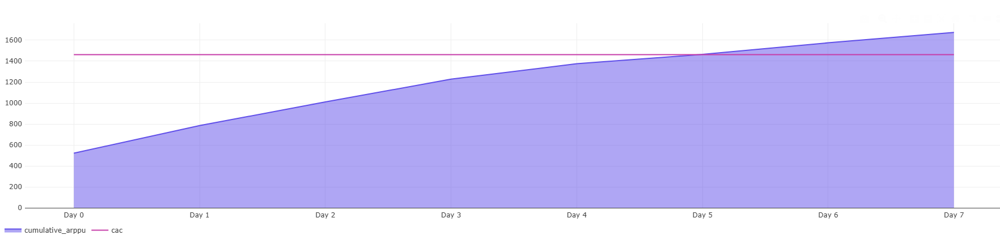

Cumulative ARPPU and CAC (Рекламная кампания №1):
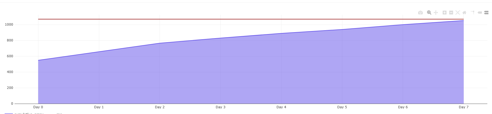
📌 **Интерпретация результата**

Вывод тут достаточно прост, для первой рекламной кампании накопительный ARPPU превысил затраты на привлечение одного покупателя (CAC) уже на 5-й день, тогда как для второй кампании даже на 7-й день значение CAC всё ещё превышало значение ARPPU.

---

## 📽️ Дашбоард маркетинговых метрик

[🔗 Перейти к интерактивному дашборду Tableau](#)

[🔗 Перейти к интерактивному дашборду Redash](https://redash.public.karpov.courses/public/dashboards/dDnbDGFDfLVIEx9C2MOfdnRB7J7al6r5ptLaG5t9?org_slug=default)

Dashboard Preview:


[📚 Содержание](#-содержание)

---

## 📦 Продуктовые метрики

### 📌 Динамика ежедневной и общей выручки (revenue)

Часть пользователей которая оформляет и оплачивает заказы и доля платящих пользователей от их общего числа, также число активных курьеров и их доля от общего числа

[📄 Посмотреть SQL-запрос](product-metrics/1-revenue/query.sql)

[📁Полный CSV](product-metrics/1-revenue/result.csv)

| date     | revenue | total_revenue | revenue_change |
| -------- | ------- | ------------- | -------------- |
| 24/08/22 | 49924   | 49924         |                |
| 25/08/22 | 430860  | 480784        | 763.03         |
| 26/08/22 | 534766  | 1015550       | 24.12          |
| 27/08/22 | 817053  | 1832603       | 52.79          |
| ...      | ...     | ...           | ...            |

---

Динамика ежедневной выручки:


Динамика общей выручки:


📌 **Интерпретация результата**

**Заметное снижение ежедневной выручки:**

1. **30/08/22**:
    - Выручка снизилась на -0.04% по сравнению с предыдущим днем.
2. **05/09/22**:
    - Выручка снизилась на -22.20% по сравнению с предыдущим днем.
3. **06/09/22**:
    - Выручка снизилась на -25.43% по сравнению с предыдущим днем.

Возможные причины снижения выручки

Для понимания возможных причин снижения выручки, нужно сопоставить эти данные с другими показателями и событиями, которые могли повлиять на выручку в эти дни

### 📌 Расчет ARPU, ARPPU, AOV

1. ARPU (Average Revenue Per User) — средняя выручка на одного пользователя за определённый период.

2. ARPPU (Average Revenue Per Paying User) — средняя выручка на одного платящего пользователя за определённый период.

3. AOV (Average Order Value) — средний чек, или отношение выручки за определённый период к общему количеству заказов за это же время.

[📄 Посмотреть SQL-запрос](product-metrics/2-arpu-arppu-aov/query.sql)

[📁Полный CSV](product-metrics/2-arpu-arppu-aov/result.csv)

| date     | arpu   | arppu  | aov    |
| -------- | ------ | ------ | ------ |
| 24/08/22 | 372.57 | 393.1  | 361.77 |
| 25/08/22 | 508.09 | 525.44 | 406.86 |
| 26/08/22 | 452.04 | 470.33 | 369.57 |
| 27/08/22 | 509.38 | 527.81 | 381.62 |
| 28/08/22 | 528.38 | 544.1  | 378.04 |
| ...      | ...    | ...    | ...    |

---

ARPU, ARPPU, AOV:


📌 **Интерпретация результата**

-   **ARPU (средняя выручка на пользователя):** Видим, что значения ARPU колеблются от 372.57 до 565.90. Наибольший разброс замечен в начале периода (24-26 августа), затем значения стабилизируются на более высоком уровне в первых числах сентября.
-   **ARPPU (средняя выручка на платящего пользователя):** Значения ARPPU также изменяются от 393.10 до 582.76. Наибольшие значения наблюдаются в конце августа и начале сентября.
-   **AOV (средний чек):** AOV колеблется от 361.77 до 391.76. Видим относительно устойчивые значения с небольшими колебаниями на протяжении всего периода.
-   **Высокие значения:**
    -   27/08/22 имеет высокие значения ARPU (509.38) и ARPPU (527.81), что может указывать на активную покупательскую активность в этот день.
    -   03/09/22 также отличается высоким ARPU (565.90) и ARPPU (582.76).
-   **Низкие значения:**

    -   24/08/22 начальные значения ARPU (372.57) и ARPPU (393.10) являются наименьшими за рассматриваемый период.
    -   06/09/22 также выделяется относительно низкими показателями ARPU (475.33) и ARPPU (492.75).

-   Из данных можно сделать вывод, что ARPU и ARPPU демонстрируют, что в среднем каждый платящий пользователь приносит большую выручку, чем средний пользователь, учитывая всех пользователей.
-   ARPU показывает среднюю выручку на всех пользователей включая как платящих, так и не платящих.
-   ARPPU фокусируется на средней выручке на платящих пользователей

### 📌 Расчёт динамически ARPU, ARPPU и AOV

Накопленная выручка на пользователя (Running ARPU).
Накопленная выручка на платящего пользователя (Running ARPPU).
Накопленная выручка с заказа, или средний чек (Running AOV).

**Важно учесть что к paying_users и users надо применить накопительный эффект, что подразумевает работу с датой первого действия пользователя**

[📄 Посмотреть SQL-запрос](product-metrics/3-running-arpu-arppu-aov/query.sql)

[📁Полный CSV](product-metrics/3-running-arpu-arppu-aov/result.csv)

| date     | running_arpu | running_arppu | running_aov |
| -------- | ------------ | ------------- | ----------- |
| 24/08/22 | 372.57       | 393.1         | 361.77      |
| 25/08/22 | 499.26       | 517.53        | 401.66      |
| 26/08/22 | 512.9        | 530.87        | 384.1       |
| 27/08/22 | 571.8        | 590.21        | 382.99      |
| ...      | ...          | ...           | ...         |

---

Показатели динамических ARPU, APRPPU, AOV:


📌 **Интерпретация результата**

-   **Running ARPU (Накопленная выручка на пользователя)**:
    -   **Динамика**: Метрика растет с каждым днем, начиная с 372.57 24/08/22 и достигая 1012.99 08/09/22.
    -   **Заключение**: Увеличение Running ARPU указывает на рост средней выручки на одного пользователя с течением времени.
-   **Running ARPPU (Накопленная выручка на платящего пользователя)**:
    -   **Динамика**: Метрика также показывает устойчивый рост, начиная с 393.10 24/08/22 и достигая 1028.03 08/09/22.
    -   **Заключение**: Платящие пользователи в среднем приносят больше выручки со временем, что отражает устойчивое увеличение этой метрики.
-   **Running AOV (Накопленная выручка с заказа, средний чек)**:

    -   **Динамика**: Значение Running AOV остается довольно стабильным, колеблясь вокруг 382-384 на протяжении всего периода.
    -   **Заключение**: Средний чек остается относительно постоянным, что указывает на стабильные цены и/или размер заказов.

-   **Динамика Running ARPU и Running ARPPU**: Оба показателя растут, что говорит о том, что средняя выручка на одного пользователя и на платящего пользователя увеличивается со временем.
-   **Динамика Running AOV**: Значение остается стабильным, что указывает на то, что средняя сумма заказа остается примерно одинаковой.

**Заключение**:

-   Увеличение Running ARPU и Running ARPPU при стабильном Running AOV может указывать на увеличение числа заказов на одного пользователя. Это значит, что пользователи делают больше заказов со временем, так как средняя выручка на пользователя растет, а средний чек остается стабильным.

### 📌 ARPU, ARPPU, AOV по дням недели

Посчитаем те же показатели, но в другом разрезе — не просто по дням, а по дням недели.

[📄 Посмотреть SQL-запрос](product-metrics/4-arpu-arppu-aov-per-weekdays/query.sql)

[📁Полный CSV](product-metrics/4-arpu-arppu-aov-per-weekdays/result.csv)

| date     | revenue | total_revenue | revenue_change |
| -------- | ------- | ------------- | -------------- |
| 24/08/22 | 49924   | 49924         |                |
| 25/08/22 | 430860  | 480784        | 763.03         |
| 26/08/22 | 534766  | 1015550       | 24.12          |
| 27/08/22 | 817053  | 1832603       | 52.79          |
| ...      | ...     | ...           | ...            |

---

ARPU, ARPPU, AOV по дням недели:


📌 **Интерпретация результата**

-   **Наибольшие значения ARPU и ARPPU**:
    -   ARPU и ARPPU достигают наибольших значений в **субботу** (ARPU: 578.53, ARPPU: 595.48) и **воскресенье** (ARPU: 566.23, ARPPU: 583.38).
    -   Значительное увеличение метрик также наблюдается в **понедельник** (ARPU: 555.98, ARPPU: 575.18).
-   **Соответствие стандартному поведению пользователей**:

    -   Дни с наибольшими значениями метрик приходятся на выходные дни (суббота и воскресенье), что согласуется с общим поведением пользователей сервиса доставки еды. В выходные дни люди чаще заказывают еду на дом из-за свободного времени, мероприятий, отдыха и меньшего желания готовить.
    -   Понедельник также показывает высокие значения, что может быть связано с тем, что пользователи заказывают еду на дом после выходных, когда у них остается меньше времени или желания готовить.

-   **Стабильность AOV**:
    -   Метрика AOV остается стабильной и колеблется в узком диапазоне от 378.70 до 385.87 на протяжении всей недели.
-   **Возможный сценарий**:
    -   **Увеличение числа заказов на пользователя**: Увеличение ARPU и ARPPU при стабильном AOV может означать, что пользователи делают больше заказов, но размер каждого заказа остается примерно одинаковым. Например, в выходные дни пользователи могут заказывать еду несколько раз в день или заказывать для больших компаний, но суммы каждого заказа остаются на том же уровне.
    -   **Постоянные цены на услуги**: Стабильный AOV также может указывать на постоянные цены на предлагаемые продукты и услуги, что приводит к неизменной средней стоимости заказа.
    -   **Рост числа платящих пользователей**: Увеличение ARPU и ARPPU может быть связано с ростом числа платящих пользователей в выходные дни, которые приносят больше выручки, но средняя стоимость заказа остается неизменной.

### 📌 Расчет доли выручки с заказов новых и старых пользователей

Посчитаем те же показатели, но в другом разрезе — не просто по дням, а по дням недели.

[📄 Посмотреть SQL-запрос](product-metrics/5-new-users-revenue/query.sql)

[📁Полный CSV](product-metrics/5-new-users-revenue/result.csv)

| date     | revenue | new_users_revenue | new_users_revenue_share | old_users_revenue_share |
| -------- | ------- | ----------------- | ----------------------- | ----------------------- |
| 24/08/22 | 49924   | 49924             | 100.0                   | 0.0                     |
| 25/08/22 | 430860  | 417333            | 96.86                   | 3.14                    |
| 26/08/22 | 534766  | 463326            | 86.64                   | 13.36                   |
| 27/08/22 | 817053  | 619318            | 75.8                    | 24.2                    |
| 28/08/22 | 1133370 | 801162            | 70.69                   | 29.31                   |
| ...      | ...     | ...               | ...                     |

---

Доля выручки с заказов новых и старых пользователей:
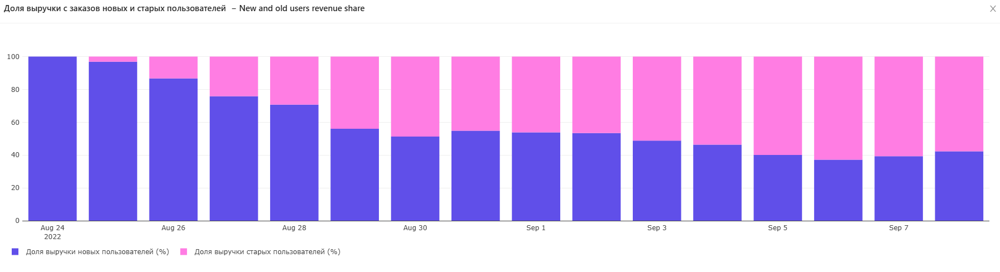

Общая выручка и выручка новых пользователей:
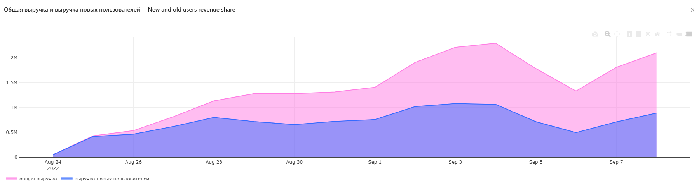

📌 **Интерпретация результата**

1. **Динамика доли выручки от новых пользователей**:
    - В первые дни после запуска сервиса (24/08/22 и 25/08/22), доля выручки от новых пользователей составляла 100% и 96.86% соответственно, что логично, так как все пользователи были новыми.
    - В следующие дни наблюдается постепенное снижение доли выручки от новых пользователей:
        - 26/08/22: 86.64%
        - 27/08/22: 75.80%
        - 28/08/22: 70.69%
        - 29/08/22: 56.05%
        - 30/08/22: 51.31%
2. **Стабилизация доли выручки**:
    - После первых нескольких дней, доля выручки от новых пользователей стабилизировалась на уровне около 50%:
        - 31/08/22: 54.88%
        - 01/09/22: 53.86%
        - 02/09/22: 53.37%
        - 03/09/22: 48.81%
        - 04/09/22: 46.38%
3. **Выручка от новых пользователей спустя две недели**:
    - Спустя две недели, доля выручки от новых пользователей продолжает оставаться значительной, хотя и ниже, чем в первые дни:
        - 05/09/22: 40.03%
        - 06/09/22: 37.20%
        - 07/09/22: 39.28%
        - 08/09/22: 42.29%

**Вывод:**

Да, можно сказать, что спустя две недели после запуска сервиса показатель выручки от новых пользователей по-прежнему на довольно высоком уровне. Несмотря на постепенное снижение, доля выручки от новых пользователей стабилизировалась на уровне около 40-50%, что является хорошим показателем для растущего сервиса. Это говорит о том, что сервис продолжает привлекать новых пользователей, которые приносят значительную часть выручки.

### 📌 Доля выручки товаров (от общей выручки)

Для каждого товара, представленного в таблице products, за весь период времени в таблице orders рассчитаны:

-   Суммарая выручка, полученная от продажи этого товара за весь период.
-   Доля выручки от продажи этого товара в общей выручке, полученной за весь период.

[📄 Посмотреть SQL-запрос](product-metrics/6-products-revenue/query.sql)

[📁Полный CSV](product-metrics/6-products-revenue/result.csv)

| product_name    | revenue | share_in_revenue |
| --------------- | ------- | ---------------- |
| свинина         | 1353600 | 6.24             |
| ДРУГОЕ          | 1225387 | 5.64             |
| курица          | 1171140 | 5.4              |
| масло оливковое | 1163250 | 5.37             |
| говядина        | 977170  | 4.51             |
| баранина        | 709930  | 3.27             |
| ...             | ...     | ...              |

---

Доля выручки товаров (от общей выручки):
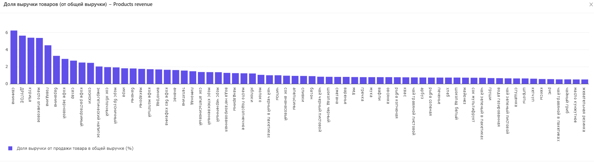

📌 **Интерпретация результата**

На основе предоставленных данных можно сделать следующие выводы:
Товары с наибольшей долей в выручке (ТОП-5):

-   Свинина - 6.24%
-   Другое - 5.64%
-   Курица - 5.40%
-   Масло оливковое - 5.37%
-   Говядина - 4.51%

Группировка товаров в более широкие категории:
Если объединить товары в более широкие группы, то мясные продукты (свинина, курица, говядина, баранина, телятина) в сумме дают:
6.24% + 5.40% + 4.51% + 3.27% + 1.55% = 20.97% от общей выручки.

Это значительно больше, чем любая другая возможная группа:
Кофе (зерновой, растворимый, молотый, без кофеина): ~8.76%
Масла (оливковое, подсолнечное, кунжутное): ~7.11%
Напитки (соки, морсы, вода, лимонад и др.): ~12-15%

**Вывод:**
Мясная продукция (свинина, курица, говядина и другие виды мяса) была бы безусловным лидером по доле в выручке (20.97%), если объединить товары в более широкие категории. Это ключевая продуктовая группа для данного набора данных.

### 📌 Динамика суммарной валовой прибыли

Для каждого дня в таблицах orders и courier_actions рассчитаны следующие показатели:

Выручка, полученная в этот день.
Затраты, образовавшиеся в этот день.
Сумма НДС с продажи товаров в этот день.
Валовая прибыль в этот день (выручка за вычетом затрат и НДС).
Суммарная выручка на текущий день.
Суммарные затраты на текущий день.
Суммарный НДС на текущий день.
Суммарная валовая прибыль на текущий день.
Доля валовой прибыли в выручке за этот день.
Доля суммарной валовой прибыли в суммарной выручке на текущий день .

[📄 Посмотреть SQL-запрос](product-metrics/7-gross-profit-dynamics/query.sql)

[📁Полный CSV](product-metrics/7-gross-profit-dynamics/result.csv)

| date     | revenue | costs  | tax      | gross_profit | total_revenue | total_costs | total_tax | total_gross_profit | gross_profit_ratio | total_gross_profit_ratio |
| -------- | ------- | ------ | -------- | ------------ | ------------- | ----------- | --------- | ------------------ | ------------------ | ------------------------ |
| 24/08/22 | 49924   | 159120 | 6334.09  | -115530.09   | 49924         | 159120      | 6334.09   | -115530.09         | -231.41            | -231.41                  |
| 25/08/22 | 430860  | 447560 | 53545.01 | -70245.01    | 480784        | 606680      | 59879.1   | -185775.1          | -16.3              | -38.64                   |
| 26/08/22 | 534766  | 565680 | 66229.97 | -97143.97    | 1015550       | 1172360     | 126109.07 | -282919.07         | -18.17             | -27.86                   |
| ...      | ...     | ...    | ...      |

---

Динамика валовой прибыли:
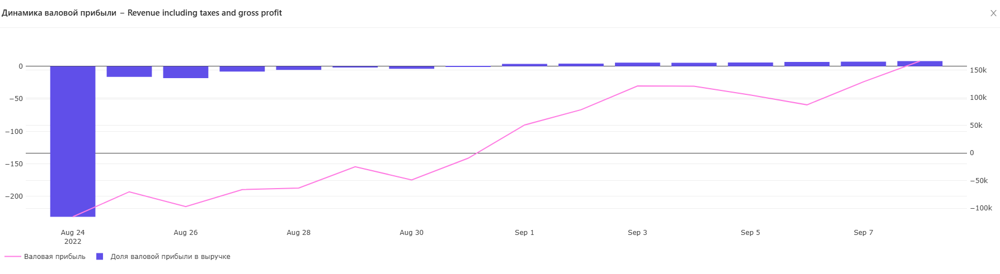

Динамика суммарной валовой прибыли:
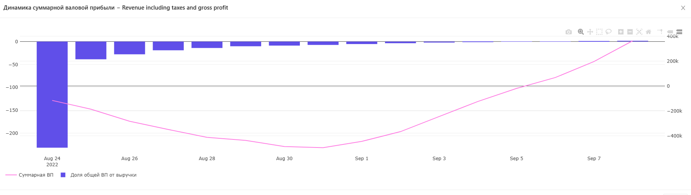

📌 **Интерпретация результата**

Согласно данным, валовая прибыль стала положительной с 1 сентября 2022 года:

-   01/09/22: 50,754.95

Сервис впервые «вышел в плюс» по суммарной валовой прибыли 6 сентября 2022 года:

-   06/09/22: 68,369.39

Можно сказать, что оптимизация стоимости сборки заказа в сентябре позволила увидеть положительную валовую прибыль в этом месяце. После оптимизации валовая прибыль начала увеличиваться, начиная с 1 сентября. Сначала ежедневная валовая прибыль стала положительной, а затем и суммарная валовая прибыль превысила нулевую отметку 6 сентября.

## 📽️ Дашбоард продуктовых метрик

[🔗 Перейти к интерактивному дашборду Tableau](https://public.tableau.com/app/profile/julustan.zakha/viz/1_17452262741800/RevenueARPUARPPUAOV)

[🔗 Перейти к интерактивному дашборду Redash](https://redash.public.karpov.courses/public/dashboards/VNAePE7TKL0UiGVVz6vMjYLjjqqWVEdwUBoCjWEW?org_slug=default)

Dashboard Preview:


[📚 Содержание](#-содержание)

---

## 🛠️ Анализ заказов и действий пользователей и курьеров

### 📌 Динамика числа пользователей и курьеров

Насколько быстро растёт аудитория сервиса (динамика числа пользователей и курьеров):

[📄 Посмотреть SQL-запрос](dynamics-users-couriers/1-dynamics-of-the-number-of-users-and-couriers/query.sql)

[📁Полный CSV](dynamics-users-couriers/1-dynamics-of-the-number-of-users-and-couriers/result.csv)

| date     | new_users | new_couriers | total_users | total_couriers |
| -------- | --------- | ------------ | ----------- | -------------- |
| 24/08/22 | 134       | 95           | 134         | 95             |
| 25/08/22 | 829       | 242          | 963         | 337            |
| 26/08/22 | 1017      | 219          | 1980        | 556            |
| ...      | ...       | ...          | ...         | ...            |

---

Динамика новых пользователей и курьеров:


Динамика общего числа пользователей и курьеров:


📌 **Интерпретация результата**

**Анализ роста и стабильности показателей**

-   **Количество пользователей (total_users)**:
    -   Количество пользователей начало с 134 и увеличилось до 21,401 за рассматриваемый период.
    -   Темпы прироста пользователей варьировались, но в целом количество пользователей росло быстрее в абсолютных числах.
-   **Количество курьеров (total_couriers)**:
    -   Количество курьеров начало с 95 и увеличилось до 2,826 за тот же период.
    -   Темпы прироста курьеров также варьировались, но их количество росло медленнее в абсолютных числах по сравнению с пользователями.

**Вывод**: Абсолютное количество пользователей растет быстрее, чем количество курьеров.

**Стабильность показателей числа новых пользователей и курьеров**

-   **Число новых пользователей (new_users_change)**:
    -   Показатель изменяется от -28.43% до 518.66%, показывая значительные колебания.
-   **Число новых курьеров (new_couriers_change)**:
    -   Показатель изменяется от -48.83% до 154.74%, также показывая значительные колебания.
-   **Дни с сильными колебаниями**:
    -   **25/08/22**: Очень высокий прирост новых пользователей (518.66%) и курьеров (154.74%).
    -   **30/08/22**: Отрицательный прирост новых пользователей (-8.02%) при положительном приросте новых курьеров (16.51%).
    -   **03/09/22**: Отрицательный прирост новых курьеров (-29.69%) при незначительном положительном приросте новых пользователей (1.96%).
    -   **04/09/22**: Положительный прирост новых курьеров (27.33%) при незначительном приросте новых пользователей (1.46%).
    -   **06/09/22**: Отрицательный прирост как новых пользователей (-26.99%), так и новых курьеров (-18.33%).
    -   **07/09/22**: Очень высокий прирост новых курьеров (124.49%) при значительном приросте новых пользователей (38.43%).

**Вывод**: В данных есть несколько дней с сильными колебаниями, что указывает на нестабильность показателей. Нельзя сказать, что показатель числа новых курьеров более стабилен, чем показатель числа новых пользователей. Оба показателя демонстрируют значительные колебания, указывая на нестабильность в обоих случаях.

### 📌 Динамика прироста числа новых пользователей и курьеров

Динамика показателей в относительных величинах (прирост числа новых пользователей и курьеров, общего числа пользователей и курьеров)

[📄 Посмотреть SQL-запрос](dynamics-users-couriers/2-growth-dynamics-in-percentage/query.sql)

[📁Полный CSV](dynamics-users-couriers/2-growth-dynamics-in-percentage/result.csv)

| new_users | new_couriers | total_users | total_couriers | new_users_change | new_couriers_change | total_users_growth | total_couriers_growth |
| --------- | ------------ | ----------- | -------------- | ---------------- | ------------------- | ------------------ | --------------------- |
| 134       | 95           | 134         | 95             |                  |                     |                    |                       |
| 829       | 242          | 963         | 337            | 518.66           | 154.74              | 618.66             | 254.74                |
| 1017      | 219          | 1980        | 556            | 22.68            | -9.5                | 105.61             | 64.99                 |
| 1225      | 186          | 3205        | 742            | 20.45            | -15.07              | 61.87              | 33.45                 |
| 1487      | 213          | 4692        | 955            | 21.39            | 14.52               | 46.4               | 28.71                 |
| 1309      | 109          | 6001        | 1064           | -11.97           | -48.83              | 27.9               | 11.41                 |
| ...       | ...          | ...         | ...            | ...              | ...                 | ...                | ...                   |

---

Динамика прироста числа новых пользователей и курьеров:


Динамика прироста общего числа пользователей и курьеров:


📌 **Интерпретация результата**

**Изменение темпов прироста общего числа пользователей и курьеров:**

-   **Общее число пользователей (total_users)**:
    -   Начинается с 134 пользователей и увеличивается до 21,401 к 08/09/22.
    -   Темпы прироста (total_users_growth) колеблются, начиная с 618.66% на второй день, уменьшаясь до 5.90% к 06/09/22, затем немного увеличиваясь до 8.47% к 08/09/22.
-   **Общее число курьеров (total_couriers)**:
    -   Начинается с 95 курьеров и увеличивается до 2,826 к 08/09/22.
    -   Темпы прироста (total_couriers_growth) также колеблются, начиная с 254.74% на второй день, затем постепенно уменьшаясь до 4.25% к 06/09/22 и незначительно увеличиваясь до 7.70% к 08/09/22.

**Общая динамика:**

-   **Темпы прироста общего числа пользователей и курьеров** в целом снижаются. Высокие начальные темпы объясняются низкими начальными значениями. С течением времени, по мере увеличения базового значения, темпы прироста стабилизируются и показывают тенденцию к замедлению.

**Дни, когда темп прироста числа новых курьеров опережал темп прироста числа новых пользователей:**

1. **25/08/22**: 154.74% (курьеры) против 518.66% (пользователи)
2. **30/08/22**: 16.51% (курьеры) против -8.02% (пользователи)
3. **31/08/22**: 53.54% (курьеры) против 17.94% (пользователи)
4. **03/09/22**: -29.69% (курьеры) против 1.96% (пользователи)
5. **04/09/22**: 27.33% (курьеры) против 1.46% (пользователи)
6. **06/09/22**: -18.33% (курьеры) против -26.99% (пользователи)
7. **07/09/22**: 124.49% (курьеры) против 38.43% (пользователи)

Эти дни можно считать ключевыми для анализа, когда темп прироста числа новых курьеров был выше, чем темп прироста числа новых пользователей.

**Стабильность показателей:**

-   **Показатель числа новых курьеров**:
    -   Показатель темпа прироста новых курьеров (new_couriers_change) сильно колеблется, начиная с 154.74% и достигая -48.83%, затем поднимаясь до 124.49% и заканчиваясь на -8.18%.
-   **Показатель числа новых пользователей**:
    -   Показатель темпа прироста новых пользователей (new_users_change) также значительно колеблется, начиная с 518.66% и доходя до -28.43%, затем поднимаясь до 38.43% и заканчиваясь на 18.34%.

**Заключение**

-   **Темпы прироста общего числа пользователей и курьеров**: С течением времени темпы прироста замедляются, что является нормальным явлением по мере увеличения базового значения.
-   **Дни, когда темп прироста числа новых курьеров опережал темп прироста числа новых пользователей**: Были дни, когда темп прироста новых курьеров опережал темп прироста новых пользователей, но это было не часто и не систематически.
-   **Стабильность показателей**: Показатели числа новых курьеров и новых пользователей оба демонстрируют значительные колебания. Нельзя сказать, что показатель числа новых курьеров более стабилен, чем показатель числа новых пользователей, так как оба показателя показывают существенную изменчивость.

### 📌 Динамика платящих пользователей и активных курьеров

Часть пользователей которая оформляет и оплачивает заказы и доля платящих пользователей от их общего числа, также число активных курьеров и их доля от общего числа

[📄 Посмотреть SQL-запрос](dynamics-users-couriers/3-dynamics-paying-active/query.sql)

[📁Полный CSV](dynamics-users-couriers/3-dynamics-paying-active/result.csv)

| date     | paying_users | active_couriers | paying_users_share | active_couriers_share |
| -------- | ------------ | --------------- | ------------------ | --------------------- |
| 24/08/22 | 127          | 93              | 94.78              | 97.89                 |
| 25/08/22 | 820          | 333             | 85.15              | 98.81                 |
| 26/08/22 | 1137         | 526             | 57.42              | 94.6                  |
| 27/08/22 | 1548         | 721             | 48.3               | 97.17                 |
| ...      | ...          | ...             | ...                |

---

Динамика платящих пользователей и активных курьеров:


Динамика долей платящих пользователей и активных курьеров:


📌 **Интерпретация результата**

**Рост числа платящих пользователей и активных курьеров**

-   Абсолютные значения (paying_users и active_couriers) растут, что говорит о росте использования сервиса как пользователями, так и курьерами.

**Снижение долей**

-   Снижение долей платящих пользователей и активных курьеров может указывать на то, что база пользователей и курьеров расширяется быстрее, чем число платящих пользователей и активных курьеров. Это может быть связано с несколькими факторами:

    -   **Привлечение новых пользователей**: Новые пользователи могут сначала тестировать сервис и не сразу становиться платящими.
    -   **Привлечение новых курьеров**: Новые курьеры могут быть менее активными на начальном этапе, пока они адаптируются к платформе.
    -   **Конкуренция и маркетинг**: Возможно, активные маркетинговые кампании привлекают много новых пользователей и курьеров, но не все из них остаются активными или платящими.

    **Нормальность и закономерность**

    -   **Нормальность**: В целом, такое поведение можно считать нормальным для растущей платформы. На начальных этапах роста базы пользователей и курьеров часто наблюдается снижение долей активных и платящих участников, так как новые пользователи и курьеры нуждаются во времени для адаптации и принятия решения о постоянном использовании сервиса.
    -   **Закономерность**: Да, это закономерно, особенно если активно привлекаются новые пользователи и курьеры через маркетинговые кампании и другие каналы.

    **Заключение**

    Вместе с общим числом пользователей и курьеров растет и число платящих пользователей и активных курьеров, что является положительным трендом. Однако доли платящих пользователей и активных курьеров снижаются, что может быть связано с быстрым расширением базы пользователей и курьеров. В целом, такая динамика является нормальной и закономерной для растущей платформы.

### 📌 Доли пользователей с одним и несколькими заказами

Доля пользователей, сделавших в день всего один заказ, в общем количестве платящих пользователей.
Доля пользователей, сделавших в день несколько заказов, в общем количестве платящих пользователей.

[📄 Посмотреть SQL-запрос](dynamics-users-couriers/4-single-several-order/query.sql)

[📁Полный CSV](dynamics-users-couriers/4-single-several-order/result.csv)

| date     | single_order_users_share | several_orders_users_share |
| -------- | ------------------------ | -------------------------- |
| 24/08/22 | 92.91                    | 7.09                       |
| 25/08/22 | 76.46                    | 23.54                      |
| 26/08/22 | 78.45                    | 21.55                      |
| 27/08/22 | 70.93                    | 29.07                      |
| ...      | ...                      | ...                        |

---

Доли пользователей с одним и несколькими заказами:


📌 **Интерпретация результата**

**На каком уровне в среднем держится доля пользователей с несколькими заказами:**

можно определить на глаз, либо дополнительным запросом по типу

```sql
AVG(several_orders_users_share) AS avg_several_orders_users_share
```

Средняя доля пользователей с несколькими заказами составляет около 28.61%.
**Можно ли считать значение показателя в первый день аномально низким, если принять во внимание общее количество пользователей в этот день:**

Для этого нужно сравнить значение показателя в первый день с другими днями и определить, насколько оно отличается от среднего значения.

-   **Уровень доли пользователей с несколькими заказами в среднем**:
    -   Средняя доля пользователей с несколькими заказами составляет 28.61%.
-   **Аномально низкое значение показателя в первый день**:
    -   В первый день (24/08/22), доля пользователей с несколькими заказами составляет 7.09%, что значительно ниже среднего значения на 21.52%. Это можно считать аномально низким показателем.

### 📌 Динамика общего числа заказов, числа первых заказов и числа заказов новых пользователей

Общее число заказов. Число первых заказов (заказов, сделанных пользователями впервые). Число заказов новых пользователей (заказов, сделанных пользователями в тот же день, когда они впервые воспользовались сервисом). Доля первых заказов в общем числе заказов. Доля заказов новых пользователей в общем числе заказов.

[📄 Посмотреть SQL-запрос](dynamics-users-couriers/5-dynamics-total-first-new-users-order/query.sql)

[📁Полный CSV](dynamics-users-couriers/5-dynamics-total-first-new-users-order/result.csv)

| date     | orders | first_orders | new_users_orders | first_orders_share | new_users_orders_share |
| -------- | ------ | ------------ | ---------------- | ------------------ | ---------------------- |
| 24/08/22 | 138    | 127          | 138              | 92.03              | 100.0                  |
| 25/08/22 | 1059   | 802          | 1032             | 75.73              | 97.45                  |
| 26/08/22 | 1447   | 984          | 1250             | 68.0               | 86.39                  |
| 27/08/22 | 2141   | 1192         | 1624             | 55.67              | 75.85                  |
| ...      | ...    | ...          | ...              |

---

Динамика общего числа заказов, числа первых заказов и числа заказов новых пользователей:


Динамика доли первых заказов и доли заказов новых пользователей в общем числе заказов:

📌 **Интерпретация результата**

-   **Динамика абсолютных показателей**: Вместе с ростом общего числа заказов наблюдается рост и числа первых заказов и числа заказов новых пользователей. Это свидетельствует о том, что рост числа заказов сопровождается ростом интереса как новых, так и существующих клиентов.

-   **Динамика относительных показателей**: Доли первых заказов и заказов новых пользователей показывают некоторую вариабельность, но в целом они отражают закономерности роста и адаптации пользователей к сервису. Снижение доли новых пользователей в общем числе заказов может свидетельствовать о насыщении рынка или изменении стратегии привлечения клиентов.
-   **Прогноз на будущее**: В долгосрочной перспективе можно ожидать, что общее количество заказов будет продолжать расти, однако рост доли первых заказов и новых пользователей может замедлиться по мере насыщения рынка. Важно будет поддерживать интерес и лояльность клиентов через улучшение сервиса и маркетинговые стратегии.

### 📌 Динамика числа пользователей и заказов на одного курьера

Число платящих пользователей на одного активного курьера. Число заказов на одного активного курьера.

[📄 Посмотреть SQL-запрос](dynamics-users-couriers/6-dynamics-users-orders-number-per-courier/query.sql)

[📁Полный CSV](dynamics-users-couriers/6-dynamics-users-orders-number-per-courier/result.csv)

| date     | users_per_courier | orders_per_courier |
| -------- | ----------------- | ------------------ |
| 24/08/22 | 1.37              | 1.48               |
| 25/08/22 | 2.46              | 3.18               |
| 26/08/22 | 2.16              | 2.75               |
| 27/08/22 | 2.15              | 2.97               |
| ...      | ...               | ...                |

---

Динамика числа пользователей и заказов на одного курьера:


📌 **Интерпретация результата**

Динамика числа пользователей на одного курьера и числа заказов на одного курьера в целом совпадает. Оба показателя показывают схожие тенденции, что логично, поскольку увеличение числа пользователей приводит к увеличению числа заказов, а снижение числа пользователей приводит к снижению числа заказов. Это связано с тем, что каждый пользователь вносит вклад в общее количество заказов, и таким образом, изменения в количестве пользователей влияют на количество заказов.

Рассматриваемые показатели сначала показывают рост, достигая пиков в конце августа, а затем начинают снижаться к началу сентября:

-   **Число пользователей на одного курьера (users_per_courier)**: Сначала растет, достигая пика 28 августа (2.25), затем начинает снижаться, достигнув минимального значения 06 сентября (1.43).
-   **Число заказов на одного курьера (orders_per_courier)**: Тоже растет до конца августа, затем начинает снижаться, достигнув минимального значения 06 сентября (1.83).

Такая динамика может указывать на изменение спроса на услуги или на изменение числа курьеров. Увеличение числа курьеров может снизить нагрузку на каждого из них, тогда как увеличение числа пользователей без пропорционального увеличения числа курьеров может повысить нагрузку.

**Нагрузка на курьеров**: В среднем, курьеры обрабатывают 1.5-3 заказа в день. Это умеренная нагрузка, но нужно учитывать специфику работы курьеров: расстояния, время доставки, ожидание заказов и т.д.

**Увеличение числа курьеров**: Если динамика снижения числа заказов на курьера продолжится, сервису стоит приостановить наращивание численности курьеров, чтобы избежать ситуации, когда у каждого курьера слишком мало заказов. Однако, если ожидается рост числа пользователей или заказов в будущем, сервису стоит подготовиться к этому, увеличив число курьеров заранее.

**Баланс**: Важно найти баланс между количеством курьеров и числом заказов, чтобы обеспечить высокое качество сервиса (вовремя выполненные заказы) и удовлетворенность курьеров (достаточное количество заказов).

Таким образом, текущая динамика указывает на снижение нагрузки на курьеров, что может быть связано с ростом числа курьеров. Важно следить за дальнейшей динамикой и корректировать стратегию в зависимости от изменений в спросе на услуги.

### 📌 Динамика среднего времени доставки заказов

[📄 Посмотреть SQL-запрос](dynamics-users-couriers/7-dynamics-users-orders-per-courier/query.sql)

[📁Полный CSV](dynamics-users-couriers/7-dynamics-users-orders-per-courier//result.csv)

| date     | minutes_to_deliver |
| -------- | ------------------ |
| 24/08/22 | 20                 |
| 25/08/22 | 20                 |
| 26/08/22 | 20                 |
| ...      | ...                |

---

Динамика среднего времени доставки заказов:


📌 **Интерпретация результата**

1. **Стабильность времени доставки**: Данные показывают, что среднее время доставки заказа составляет 20 минут для каждого дня в рассматриваемом периоде. Это указывает на очень стабильное время доставки.
2. **Целевое время ожидания доставки**: Поскольку среднее время доставки стабильно составляет 20 минут, можно предположить, что это целевое время ожидания доставки, установленное сервисом. Курьеры эффективно придерживаются этого времени.
3. **Вывод**:
    - **Время ожидания доставки**: Скорее всего, среднее время ожидания доставки заказа в вашем сервисе составляет 20 минут.
    - **Придерживание целевого показателя**: Да, курьеры успешно придерживаются этого целевого показателя, что говорит о высоком уровне организации работы и эффективности курьеров.

**Заключение**
Курьеры демонстрируют отличные результаты, доставляя заказы в среднем за 20 минут каждый день. Это стабильное и, вероятно, целевое время доставки, что позитивно сказывается на уровне удовлетворенности клиентов. Если время доставки действительно является одним из ключевых показателей качества вашего сервиса, можно считать, что курьеры выполняют свою работу на высоком уровне.

### 📌 Динамика доли отмененных заказов в общем числе заказов и числа успешных/отменённых заказов

[📄 Посмотреть SQL-запрос](dynamics-users-couriers/8-dynamics-cancel-rate-successful-cancelled-orders/query.sql)

[📁Полный CSV](dynamics-users-couriers/8-dynamics-cancel-rate-successful-cancelled-orders/result.csv)

| hour | successful_orders | canceled_orders | cancel_rate |
| ---- | ----------------- | --------------- | ----------- |
| 0    | 2297              | 139             | 0.057       |
| 1    | 1867              | 98              | 0.05        |
| 2    | 1422              | 62              | 0.042       |
| ...  | ...               |

---

Динамика показателя cancel rate и числа успешных/отменённых заказов:


📌 **Интерпретация результата**

**Пиковые значения числа оформляемых заказов:**

-   Наибольшее количество заказов наблюдается в часы: 18, 19, 20.
-   В частности, в 19:00 было зафиксировано наибольшее количество заказов — 3,496.

**Минимальные значения числа оформляемых заказов:**

-   Наименьшее количество заказов наблюдается в часы: 3, 4, 2.
-   В частности, в 3:00 было зафиксировано наименьшее количество заказов — 958.

Для анализа взаимосвязи между количеством оформляемых заказов и долей отменённых заказов (cancel rate) можно рассмотреть, как изменяется cancel rate в зависимости от общего числа заказов.

**Общий анализ:**

-   В часах с пиковыми значениями числа заказов (например, 18, 19, 20) cancel rate находится на уровне около 0.049-0.051, что не слишком отличается от среднего значения.
-   В часах с минимальными значениями числа заказов (например, 2, 3, 4) cancel rate также находится в пределах 0.042-0.055.

**Заключение:**

-   В целом, не прослеживается явной зависимости между количеством оформляемых заказов и долей отменённых заказов. Показатель cancel rate не демонстрирует значимого роста или уменьшения с увеличением числа заказов.

## 📽️ Дашбоард для анализа заказов, действий пользователей и курьеров

[🔗 Перейти к интерактивному дашборду](https://redash.public.karpov.courses/public/dashboards/H1gwTB0BaFpdh8LDkOytbDOXPvbtqRqzhCCDT3P7?org_slug=default)

Dashboard Preview:


[📚 Содержание](#-содержание)

---

## 📬 Обратная связь

Если у вас есть вопросы, идеи или предложения, открывайте issue или пишите мне!
